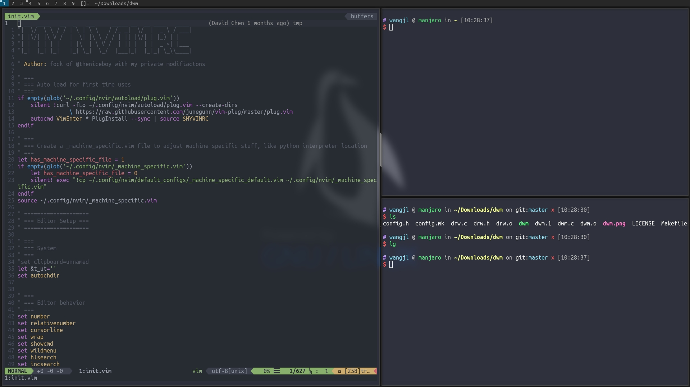

### 这是我编译的DWM,基于dwm-6.2
```
██████╗ ██╗    ██╗███╗   ███╗
██╔══██╗██║    ██║████╗ ████║
██║  ██║██║ █╗ ██║██╔████╔██║
██║  ██║██║███╗██║██║╚██╔╝██║
██████╔╝╚███╔███╔╝██║ ╚═╝ ██║
╚═════╝  ╚══╝╚══╝ ╚═╝     ╚═╝
```
#### 包含的补丁
- `dwm-alpha-20180613-b69c870.diff` 透明补丁<br/>
- `dwm-autostart-20161205-bb3bd6f.diff` 启动脚本补丁<br/>
- ~~`dwm-awesomebar-20191003-80e2a76.diff` (该补丁有bug已经移除) 任务栏增强补丁<br/>~~
- `dwm-fullgaps-6.2.diff` 窗口间距补丁<br/>
- `dwm-fullscreen-6.2.diff` 全屏补丁<br/>
- `dwm-pertag-20170513-ceac8c9.diff` 每个tag保存不同的布局状态补丁<br/>
- `dwm-scratchpad-6.2.diff` 便签功能补丁<br/>
- `alphasystray.diff` 任务栏图标补丁<br/>

另外求窗口圆角补丁,有知道的麻烦告诉我下，万分感谢。

#### 安装
克隆下来后 `sudo make clean install` 安装过程可能你会缺少一些依赖,根据报错安装好依赖即可。<br/>
如果你使用了启动管理器,那么在登录时选择dwm即可。<br/>
如果你没有使用启动管理器,那么在 `.xinitrc` 写入一行 `exec dwm` 即可startx启动dwm<br/>

#### 截图

